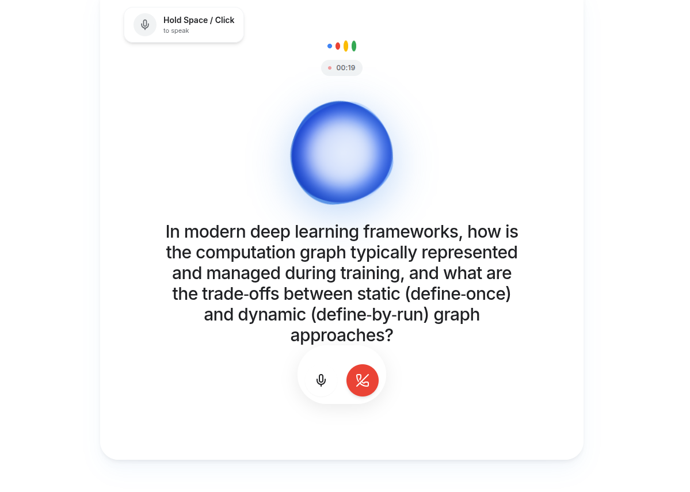
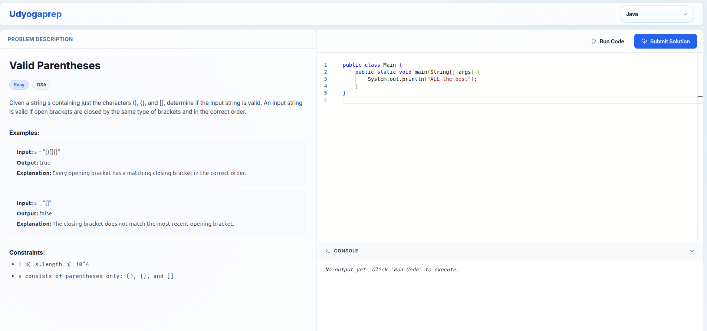

# AI Interview & Coding Platform (UdyogaPrep)

An end-to-end, high-pressure AI Interview Workspace combining natural voice dialogue, resume parsing, multi-phase technical grilling, dynamic Monaco code editor, and multi-language online compilation powered by **Judge0 API** and **Microsoft Edge TTS**.

---

## Interface Screenshots

> [!NOTE]  
> *Screenshot Placeholders: Upload your application screenshots to a `screenshots/` directory (or update image paths below) once taken.*

| AI Voice Interviewer | Monaco Code Editor & Compiler |
| :---: | :---: |
| <br><sub>*Interactive Voice & Speech AI Interview Workspace*</sub> | <br><sub>*Monaco Code Editor with Judge0 API Multi-Language Execution*</sub> |

---

## Text-to-Speech (TTS) Engine Details

The application utilizes a robust hybrid TTS architecture:

### 1. Primary Runtime Engine: **Microsoft Edge TTS (`node-edge-tts`)**
- **Neural Voice Model**: Uses high-fidelity neural voices (`en-US-ChristopherNeural` / `en-US-JennyNeural`).
- **Mechanism**: Converts text to MP3 speech buffers dynamically via `/api/tts`.
- **Low Latency & Control**: Employs AbortControllers and watchdog timers to manage real-time playback, user interruptions, and automatic microphone recycling.

### 2. Local Research & Development Engine: `TTS.ipynb`
- **Purpose**: Local notebook for GPU-accelerated TTS model testing (e.g. Coqui XTTS / custom PyTorch TTS models).
- **Tunneling**: Can be exposed during development via **ngrok** (`NGROK_AUTH_TOKEN`) to serve high-quality local models without cloud dependencies.

---

## Code Compilation & Execution API

Code compilation and test case execution are powered by the **Judge0 API Engine**:

- **API Endpoint**: `https://ce.judge0.com/submissions` (bridged via `/api/execute_code.js`).
- **Supported Languages & Runtime Environments**:
  - **Python** (v3.12.5)
  - **JavaScript / Node.js** (v22.08.0)
  - **C++** (GCC v14.1.0)
  - **Java** (JDK v17.0.6)
  - **Go** (v1.23.5)
  - **Rust** (v1.85.0)
  - **TypeScript** (v5.6.2)
  - **C#** (Mono v51)
  - **C** (GCC v14.1.0)
  - **PHP**, **Ruby**, **Swift**
- **Execution & Validation Features**:
  - Real-time execution of candidate code against visible and hidden test cases.
  - Support for custom `stdin` inputs and normalized stdout/stderr comparison.
  - Instant detection of runtime errors, compile-time failures, time-out conditions, and status codes (e.g., Accepted vs. Wrong Answer).

---

## Complete Interview Process Workflow

The platform delivers a structured 5-phase interview progression tailored to the candidate's resume and target job role.

```

                            ONBOARDING & SETUP                               
  1. Select Goal (Internship vs. Job Role)                                   
  2. Upload & Parse Resume (PDF/DOCX via pdf-parse)                          
  3. Optional Job Description Input                                          

                                       
                                       

                       5-PHASE AI INTERVIEW WORKFLOW                         

  Phase 1: The Hook         Identify tech stack & candidate core domain     
  Phase 2: Deep Dive        2-3 "Under-the-hood" core concepts (e.g. GIL)   
  Phase 3: The Build        Resume project architecture & implementation    
  Phase 4: The Stress Test  System design scalability & bottleneck challenge
  Phase 5: The DSA Challenge  Formulate LeetCode Medium/Hard DSA problem     

                                       
                                       

                      MONACO EDITOR & JUDGE0 COMPILER                        
  1. Candidate clicks "Open Code Editor" (opens /editor in new tab)          
  2. Write code with Monaco IntelliSense & multi-language support            
  3. Run test cases against Judge0 API endpoint                              
  4. Submit solution (sends ATTEMPT_VERDICT back to AI session)              

                                       
                                       

                       AI CODE REVIEW & ANALYTICS                            
  1. AI reviews code logic, time/space complexity, & edge cases              
  2. Spoken voice feedback via Edge TTS                                      
  3. Save session results, scores, & metrics to Dashboard                    

```

### Detailed Step-by-Step Breakdown:

1. **Step 1: Setup & Candidate Ingestion**
   - Candidate selects role focus (Internship vs. Professional Job).
   - Candidate uploads resume (`.pdf`, `.docx`, `.txt`), extracted instantly via `pdf-parse` (`/api/parse-resume`).
   - Context is injected into the AI system prompt to personalize all technical questions.

2. **Step 2: Dual-Mode Speech Interaction**
   - Natural audio conversation using WebRTC & MediaRecorder.
   - Microphone input is transcribed via `/api/transcribe` (Whisper STT model or push-to-talk Spacebar control).
   - Responses are dynamically spoken back using Edge TTS with animated state indicators (`listening`, `analyzing`, `speaking`).

3. **Step 3: Phase Technical Progression**
   - **Phase 1**: Technical domain assessment.
   - **Phase 2**: Deep-dive theoretical questions (e.g., Python memory management, event loop, garbage collection).
   - **Phase 3**: Project execution review based on candidate's uploaded resume.
   - **Phase 4**: Scaling & stress-test scenario (handling 1M+ requests, caching, database indexing).
   - **Phase 5**: Assignment of a Data Structures & Algorithms (DSA) coding challenge.

4. **Step 4: Monaco Code Editor & Judge0 Compilation**
   - Upon reaching Phase 5, candidate launches the Monaco code editor (`/editor`).
   - Candidate writes solution, runs code against test inputs, and checks output powered by Judge0 API.
   - Code submission sends `ATTEMPT_VERDICT` (`solved`, `near_answer`, `not_sure`) and solution code back to the AI session.

5. **Step 5: Code Review & Session Analytics**
   - AI evaluates candidate's code quality, edge case handling, and time/space complexity.
   - Spoken audio feedback is generated and overall metrics are archived to the candidate dashboard.

---

## Project Architecture

```
.
 my-app/                 # Next.js Full-Stack Application
    pages/              # App Pages
       interview.tsx   # Interactive AI Voice Interviewer workspace
       editor.tsx      # Monaco Code Editor page
       dashboard.tsx   # Performance analytics & past interviews
       api/            # API Endpoints
           execute_code.js  # Judge0 API code execution bridge
           tts.js           # Edge TTS audio generator API
           transcribe.js    # Whisper speech-to-text API
           parse-resume.js  # PDF/DOCX resume text extractor
           chat.js          # AI interviewer core reasoning route
    components/         # Reusable UI & Monaco Editor components
    styles/             # Modern CSS & Tailwind styling
 TTS.ipynb               # Local GPU TTS notebook & ngrok tunnel setup
 INTERVIEW_IMPROVEMENTS.md # Comprehensive flow improvements changelog
 README.md               # Main project documentation
```

---

## Local Setup Guide

1. **Clone the Repository**:
   ```bash
   git clone <repository-url>
   cd interview
   ```

2. **Install Dependencies**:
   ```bash
   cd my-app
   npm install
   ```

3. **Configure Environment Variables**:
   Create a `.env` file in `my-app/` with your local credentials:
   ```env
   MONGODB_URI=your_mongodb_connection_string
   FIREBASE_CONFIG=your_firebase_config
   OPENAI_API_KEY=your_openai_api_key
   ```

4. **Launch Development Server**:
   ```bash
   npm run dev
   ```
   Open [http://localhost:3000](http://localhost:3000) in your browser.

5. **(Optional) Local TTS Setup**:
   Launch `TTS.ipynb` in Jupyter Notebook if hosting a custom local GPU TTS server exposed via ngrok.

